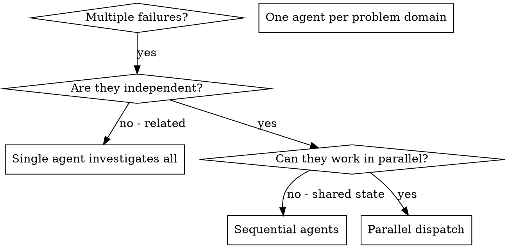

# Dispatching Parallel Agents

## Overview

You delegate tasks to specialized agents with isolated context. By precisely crafting their instructions and context, you ensure they stay focused and succeed at their task. They should never inherit your session's context or history — you construct exactly what they need. This also preserves your own context for coordination work.

When you have multiple unrelated failures (different test files, different subsystems, different bugs), investigating them sequentially wastes time. Each investigation is independent and can happen in parallel.

**Core principle:** Dispatch one agent per independent problem domain. Let them work concurrently.

## Not for plan execution

This skill is for **investigating independent failures**, before you know what the fix is.

If you are executing an implementation plan, `sdd-harness:subagent-driven-development` governs
instead, and it says the opposite: *"Never dispatch multiple implementation subagents in
parallel (conflicts)."* That is not a contradiction — plan tasks share a branch and a codebase
that each implementer is actively editing, so parallel implementers collide. Independent
failure investigations do not.

The boundary is what the agents are doing, not how many there are: **diagnosing separate
failures → here. Implementing tasks from a plan → subagent-driven-development.**

## When to Use



**Use when:**
- 3+ test files failing with different root causes
- Multiple subsystems broken independently
- Each problem can be understood without context from others
- No shared state between investigations

The exclusions live in §When NOT to Use — one list, further down, and it is the complete one.

## The Pattern

### 1. Identify Independent Domains

Group failures by what's broken:
- File A tests: Tool approval flow
- File B tests: Batch completion behavior
- File C tests: Abort functionality

Each domain is independent - fixing tool approval doesn't affect abort tests.

### 2. Create Focused Agent Tasks

Each agent gets:
- **Specific scope:** One test file or subsystem
- **Clear goal:** Make these tests pass
- **Constraints:** Don't change other code
- **Expected output:** Summary of what you found and fixed

### 3. Dispatch in Parallel

Issue all three subagent dispatches in the same response — they run in parallel:

```text
Subagent (general-purpose, model: <chosen>): "Fix agent-tool-abort.test.ts failures"
Subagent (general-purpose, model: <chosen>): "Fix batch-completion-behavior.test.ts failures"
Subagent (general-purpose, model: <chosen>): "Fix tool-approval-race-conditions.test.ts failures"
# All three run concurrently.
```

Multiple dispatch calls in one response = parallel execution. One per response = sequential.

**Always name the model.** An omitted model inherits your session's — often the most capable
and most expensive one — and here you are paying it several times at once.

### 4. Review and Integrate

When agents return, follow §Verification below, then integrate.

## Agent Prompt Structure

Good agent prompts are:
1. **Focused** - One clear problem domain
2. **Self-contained** - All context needed to understand the problem
3. **Specific about output** - What should the agent return?
4. **Constrained** - State what the agent must NOT touch ("Fix tests only", "Do NOT change
   production code"). Without a bound, an agent given a narrow failure may refactor broadly.
5. **File-based, both directions** - Write error output and logs to a file and pass the path;
   have the agent write its summary to a file and return one status line. Pasting logs in and
   summaries back puts every domain's full text into your context at once — which is the
   context you dispatched in parallel to protect.

```markdown
Fix the 3 failing tests in src/agents/agent-tool-abort.test.ts:

1. "should abort tool with partial output capture" - expects 'interrupted at' in message
2. "should handle mixed completed and aborted tools" - fast tool aborted instead of completed
3. "should properly track pendingToolCount" - expects 3 results but gets 0

These are timing/race condition issues. Your task:

1. Read the test file and understand what each test verifies
2. Identify root cause - timing issues or actual bugs?
3. Fix by:
   - Replacing arbitrary timeouts with event-based waiting
   - Fixing bugs in abort implementation if found
   - Adjusting test expectations if testing changed behavior

Do NOT just increase timeouts - find the real issue.

Return: Summary of what you found and what you fixed.
```

## When NOT to Use

Each of these has somewhere to go. Do not stop here.

| Situation | Go to |
| --- | --- |
| **Related failures** — fixing one might fix others | Drive one to root cause with `sdd-harness:systematic-debugging`, then check whether the rest share that cause |
| **Exploratory debugging** — you don't know what's broken yet | `sdd-harness:systematic-debugging`. Parallel agents multiply a guess; they don't replace a diagnosis |
| **Need full context** — understanding requires seeing the whole system | One agent (or you) investigating the whole, not several seeing fragments |
| **Shared state** — agents would edit the same files or contend for the same resource | Sequential dispatch, or isolate each with `sdd-harness:using-git-worktrees` |
| **Executing an implementation plan** | `sdd-harness:subagent-driven-development` — see §Not for plan execution |

## Verification

Each check needs an answer for the failing case, or it is not a check.

| Check | If it fails |
| --- | --- |
| **Review each summary** — understand what changed | A summary that does not say what changed is a failed dispatch, not a finished one. Re-dispatch that domain with the output contract restated |
| **Check for conflicts** — did two agents edit the same file? | Discard the parallel result **for those domains only** and redo them sequentially. Keep the domains that stayed disjoint — they are still good |
| **Run full suite** — do the fixes work together? | Green individually but red together means the domains were not independent. Stop dispatching in parallel and treat it as one problem: `sdd-harness:systematic-debugging` |
| **Spot check** — agents make systematic errors | If one agent's fix is wrong in a way the others could share (e.g. all bumped a timeout), check the others for the same shape before accepting any |

**BLOCKED or empty-handed return:** re-dispatch that one domain **once**, with the context the
agent said it was missing. A second BLOCKED is a signal about the problem, not the agent —
escalate to your human partner rather than dispatching a third time.

**Cap concurrency at 5.** Beyond that you cannot actually review the summaries carefully, and
the review is the part that catches the systematic errors above.
