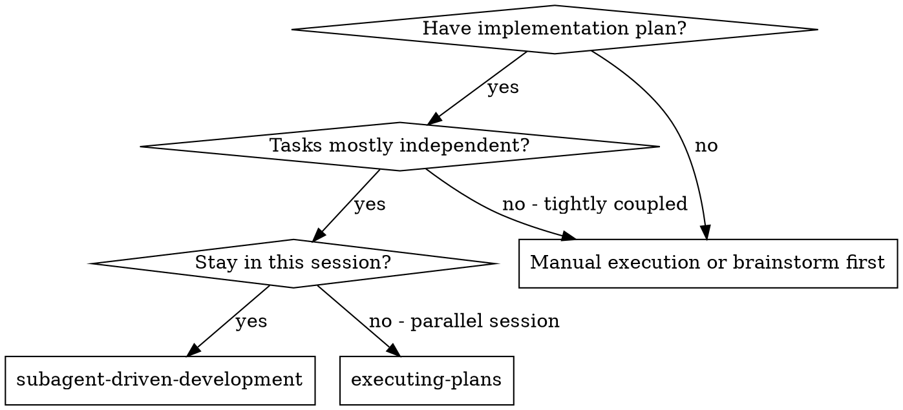
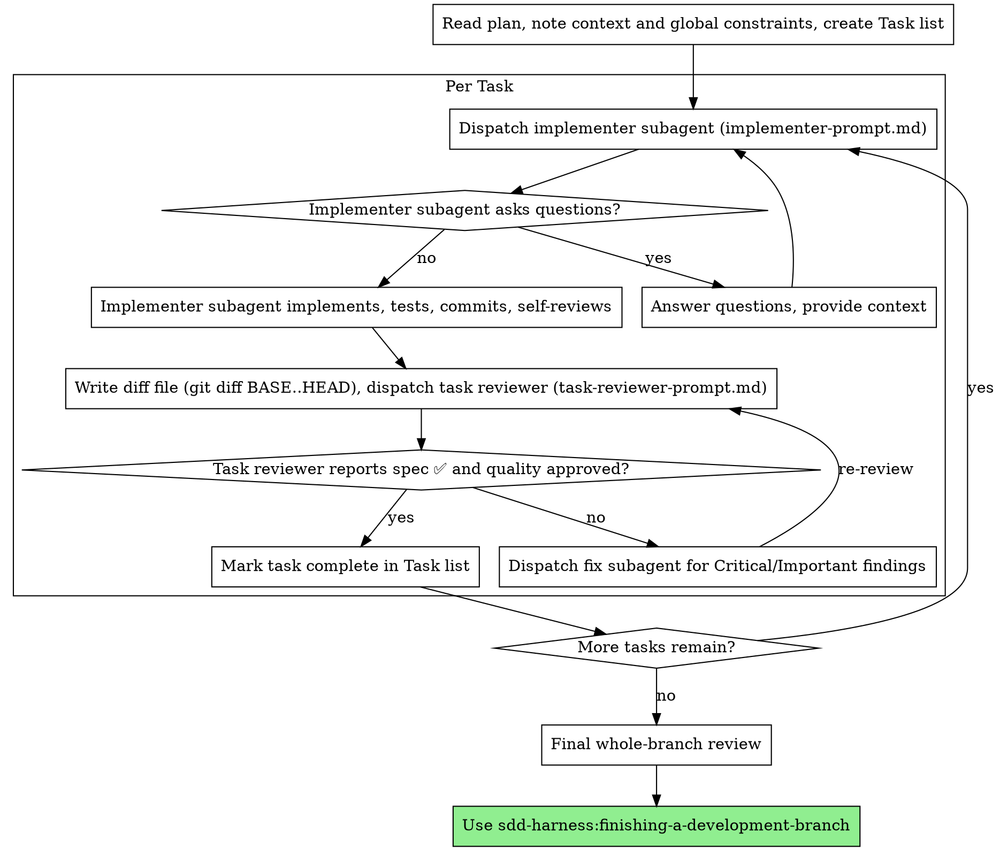

# Subagent-Driven Development (lite)

Execute plan by dispatching a fresh implementer subagent per task, a task review (spec compliance + code quality) after each, and a broad whole-branch review at the end.

> **This is the script-free variant.** It runs on the **native Agent tool plus inline `git diff`** — no bundled bash scripts (`review-package`, `task-brief`, `sdd-workspace`). Handoffs go through scratch file paths you name yourself, and the progress ledger is replaced by your harness's task list. Pick this variant when bash is unavailable or unwanted, or when you already track progress in the harness; pick `sdd-harness:subagent-driven-development` when you want the scripts to derive workspace paths, briefs, and review packages for you.

**Why subagents:** You delegate tasks to specialized agents with isolated context. By precisely crafting their instructions and context, you ensure they stay focused and succeed at their task. They should never inherit your session's context or history — you construct exactly what they need. This also preserves your own context for coordination work.

**Core principle:** Fresh subagent per task + task review (spec + quality) + broad final review = high quality, fast iteration

**Narration:** between tool calls, narrate at most one short line — the ledger and the tool results carry the record.

**Continuous execution:** Do not pause to check in with your human partner between tasks. Execute all tasks from the plan without stopping. The only reasons to stop are: BLOCKED status you cannot resolve, ambiguity that genuinely prevents progress, or all tasks complete. "Should I continue?" prompts and progress summaries waste their time — they asked you to execute the plan, so execute it.

## Dispatch Mechanism (native)

Dispatch every subagent with the **native Agent tool** (`agentType: general-purpose` unless a role-specific type fits). Pass the `model` parameter explicitly per the Model Selection section. Hand bulk artifacts (task brief, diff) as **file paths** the subagent Reads — never paste them into the dispatch prompt, which would keep them resident in your context.

Write scratch artifacts to a uniquely-named, git-ignored path (e.g. `.claude/tmp/task-N-brief.md`, `.claude/tmp/task-N-diff.txt`) or your platform's temp dir.

## When to Use



**vs. Executing Plans (parallel session):**
- Same session (no context switch)
- Fresh subagent per task (no context pollution)
- Review after each task (spec compliance + code quality), broad review at the end
- Faster iteration (no human-in-loop between tasks)

## The Process



## Setup

Ensure the work happens in an isolated workspace before dispatching Task 1 — a worktree via `sdd-harness:using-git-worktrees`, or a feature branch if the repo works that way. Follow the repo's own branch and worktree convention if its CLAUDE.md states one. Never start implementation on a main/master branch without your human partner's explicit consent.

## Pre-Flight Plan Review

Before dispatching Task 1, scan the plan once for conflicts:

- tasks that contradict each other or the plan's Global Constraints
- anything the plan explicitly mandates that the review rubric treats as a defect (a test that asserts nothing, verbatim duplication of a logic block)

Present everything you find to your human partner as one batched question — each finding beside the plan text that mandates it, asking which governs — before execution begins, not one interrupt per discovery mid-plan. If the scan is clean, proceed without comment. The review loop remains the net for conflicts that only emerge from implementation.

## Model Selection

Use the least powerful model that can handle each role to conserve cost and increase speed. The native Agent tool accepts a `model` parameter (`haiku` | `sonnet` | `opus`).

**Mechanical implementation tasks** (isolated functions, clear specs, 1-2 files): use a fast, cheap model (`haiku`). Most implementation tasks are mechanical when the plan is well-specified.

**Integration and judgment tasks** (multi-file coordination, pattern matching, debugging): use a standard model (`sonnet`).

**Architecture and design tasks**: use the most capable available model (`opus`). The final whole-branch review is one of these.

**Review tasks**: choose the model with the same judgment, scaled to the diff's size, complexity, and risk. A small mechanical diff does not need the most capable model; a subtle concurrency change does.

**Always specify the model explicitly when dispatching a subagent.** An omitted model inherits your session's model — often the most capable and most expensive — which silently defeats this section.

**Turn count beats token price.** Wall-clock and context cost scale with how many turns a subagent takes, and the cheapest models routinely take 2-3× the turns on multi-step work — costing more overall. Use a mid-tier model as the floor for reviewers and for implementers working from prose descriptions. When the task's plan text contains the complete code to write, the implementation is transcription plus testing: use the cheapest tier for that implementer. Single-file mechanical fixes also take the cheapest tier.

**Task complexity signals (implementation tasks):**
- Touches 1-2 files with a complete spec → cheap model
- Touches multiple files with integration concerns → standard model
- Requires design judgment or broad codebase understanding → most capable model

## Handling Implementer Status

Implementer subagents report one of four statuses. Handle each appropriately:

**DONE:** Generate the diff file — run `git diff BASE..HEAD` (plus `git log --oneline BASE..HEAD` and `git diff --stat BASE..HEAD`) redirected to a uniquely-named scratch file. BASE is the commit you recorded before dispatching the implementer — never `HEAD~1`, which silently drops all but the last commit of a multi-commit task. Then dispatch the task reviewer with that path.

**DONE_WITH_CONCERNS:** The implementer completed the work but flagged doubts. Read the concerns before proceeding. If the concerns are about correctness or scope, address them before review. If they're observations (e.g., "this file is getting large"), note them and proceed to review.

**NEEDS_CONTEXT:** The implementer needs information that wasn't provided. Provide the missing context and re-dispatch.

**BLOCKED:** The implementer cannot complete the task. Assess the blocker:
1. If it's a context problem, provide more context and re-dispatch with the same model
2. If the task requires more reasoning, re-dispatch with a more capable model
3. If the task is too large, break it into smaller pieces
4. If the plan itself is wrong, escalate to the human

**Never** ignore an escalation or force the same model to retry without changes. If the implementer said it's stuck, something needs to change.

## Handling Reviewer ⚠️ Items

The task reviewer may report "⚠️ Cannot verify from diff" items — requirements that live in unchanged code or span tasks. These do not block the rest of the review, but you must resolve each one yourself before marking the task complete: you hold the plan and cross-task context the reviewer lacks. If you confirm an item is a real gap, treat it as a failed spec review — send it back to the implementer and re-review.

## The Fix Loop

The loop triggers when the task review reports spec ❌, any Critical or Important finding, or a ⚠️ item you confirmed as a real gap. Two routes leave it immediately, both under §Constructing Reviewer Prompts: Minor findings go to the Task list and never enter the loop, and a plan-mandated finding is the human's decision. Everything else enters. **A fix round is one fix dispatch plus one scoped re-review. Five rounds maximum per task.**

**Rounds 1-3 — resume the original implementer.** Send it the open findings verbatim. Its context is intact: it knows the task, the code, and its own choices. If you cannot send another message to a live subagent, dispatch a fresh implementer carrying the brief path, the report-file path, and the findings — the report file is the persistent memory either way.

**Rounds 4-5 — dispatch a fresh implementer on a more capable model** (per §Model Selection), with the brief path, the report-file path, the open findings, and this framing: "A prior implementer attempted this task [N] times; you own it now. Read the report file for what was tried." A loop that survives three resumes usually means the implementer cannot see its own problem — fresh eyes and a capability bump in one move.

**The re-review is scoped.** Write the fix diff to a uniquely-named scratch file — `git log --oneline FIX_BASE..HEAD`, `git diff --stat FIX_BASE..HEAD`, `git diff -U10 FIX_BASE..HEAD`, where FIX_BASE is the head the previous review saw — and dispatch [re-review-prompt.md](re-review-prompt.md) with the findings list, the brief, the report file, and that path. The re-reviewer verdicts each finding ADDRESSED or NOT ADDRESSED and flags new breakage in the fix diff only. New Critical/Important breakage in the fix diff joins the open findings list. Out-of-scope observations go to the Task list as deferred minors — they never extend the loop.

**After each round,** record it in the Task list: `Task <N>: fix round <R>/5 (<X> addressed, <Y> open — <finding one-liners>; commits <a7>..<b7>)`.

**Never fix findings yourself in the controller session** — your context stays clean for coordination, and controller fixes skip review.

**The breaker.** When round 5's re-review still leaves findings open, stop dispatching. Adjudicate each open finding yourself — you hold the plan and the cross-task context the reviewer lacks:
1. **The reviewer is wrong, or the point is contestable** — park it: `Task <N>: parked — <finding> — ruling: <why the code stands>`. The final review sees both sides.
2. **Real, but nothing downstream builds on it** — park it the same way, with a ruling that says it is real and deferred.
3. **Real and load-bearing** (a later task builds on it, or it reveals a plan defect) — **STOP.** Record `Task <N>: BLOCKED — <reason>` and report to the human with the finding, the plan text it collides with, and the fix history. Parking a structural failure lets every dependent task build on it and hands the final review a problem it cannot fix either.

Adjudicate only at the cap. Adjudicating earlier to end a loop is pre-judging with a different name. Every adjudication is a Task list entry — a silent discard is forbidden.

**Completing the task.** When the review comes back clean — or every open finding is parked with a ruling at the cap — mark the task complete in the Task list (`complete (commits <base7>..<head7>, review clean)`, or `… <K> parked` after a tripped breaker). Never move to the next task while the review has open Critical/Important issues that are neither fixed nor parked-with-ruling at the cap.

## Constructing Reviewer Prompts

Per-task reviews are task-scoped gates. The broad review happens once, at the final whole-branch review. When you fill a reviewer template:

- Do not add open-ended directives like "check all uses" or "run race tests if useful" without a concrete, task-specific reason
- Do not ask a reviewer to re-run tests the implementer already ran on the same code — the implementer's report carries the test evidence
- Do not pre-judge findings for the reviewer — never instruct a reviewer to ignore or not flag a specific issue. If you believe a finding would be a false positive, let the reviewer raise it and adjudicate it in the review loop. If the prompt you are writing contains "do not flag," "don't treat X as a defect," "at most Minor," or "the plan chose" — stop: you are pre-judging, usually to spare yourself a review loop.
- The global-constraints block you hand the reviewer is its attention lens. Copy the binding requirements verbatim from the plan's Global Constraints section or the spec: exact values, exact formats, and the stated relationships between components ("same layout as X", "matches Y"). The reviewer's template already carries the process rules (YAGNI, test hygiene, review method) — the constraints block is for what THIS project's spec demands.
- Hand the reviewer its diff as a file: run `git log --oneline BASE..HEAD`, `git diff --stat BASE..HEAD`, and `git diff -U10 BASE..HEAD` for the range, redirected to one uniquely named file, and pass the reviewer that path. The output never enters your own context, and the reviewer sees the commit list, stat summary, and full diff with context in one Read call. Use the BASE you recorded before dispatching the implementer — never `HEAD~1`, which silently truncates multi-commit tasks.
- A dispatch prompt describes one task, not the session's history. Do not paste accumulated prior-task summaries ("state after Tasks 1-3") into later dispatches. A fresh subagent needs its task, the interfaces it touches, and the global constraints. Nothing else.
- Dispatch fix subagents for Critical and Important findings. Record Minor findings in the Task list (or a notes file) as you go, and point the final whole-branch review at that list so it can triage which must be fixed before merge. A roll-up nobody reads is a silent discard.
- A finding labeled plan-mandated — or any finding that conflicts with what the plan's text requires — is the human's decision, like any plan contradiction: present the finding and the plan text, ask which governs. Do not dismiss the finding because the plan mandates it, and do not dispatch a fix that contradicts the plan without asking.
- The final whole-branch review gets the branch diff too: `git diff MERGE_BASE..HEAD` (MERGE_BASE = the commit the branch started from, e.g. `git merge-base main HEAD`) to a file, so the final reviewer reads one file instead of re-deriving the branch diff.
- Every fix dispatch carries the implementer contract: the fix subagent re-runs the tests covering its change and reports the results. Name the covering test files in the dispatch — a one-line fix does not need the whole suite. Before re-dispatching the reviewer, confirm the fix report contains the covering tests, the command run, and the output; dispatch the re-review once all three are present.
- If the final whole-branch review returns findings, dispatch ONE fix subagent with the complete findings list — not one fixer per finding. Per-finding fixers each rebuild context and re-run suites.

## File Handoffs

Everything you paste into a dispatch prompt — and everything a subagent prints back — stays resident in your context for the rest of the session and is re-read on every later turn. Hand artifacts over as files:

- **Task brief:** before dispatching an implementer, extract the task's full text from the plan file (Read the plan, copy the task's section) into a uniquely-named scratch file (e.g. `.claude/tmp/task-N-brief.md`). Compose the dispatch so the brief stays the single source of requirements. Your dispatch should contain: (1) one line on where this task fits in the project; (2) the brief path, introduced as "read this first — it is your requirements, with the exact values to use verbatim"; (3) interfaces and decisions from earlier tasks that the brief cannot know; (4) your resolution of any ambiguity you noticed in the brief; (5) the report-file path and report contract. Exact values (numbers, magic strings, signatures, test cases) appear only in the brief.
- **Report file:** name the implementer's report file after the brief (brief `…/task-N-brief.md` → report `…/task-N-report.md`) and put it in the dispatch prompt. The implementer writes the full report there and returns only status, commits, a one-line test summary, and concerns.
- **Reviewer inputs:** the task reviewer gets three paths — the same brief file, the report file, and the diff file — plus the global constraints that bind the task.
- Fix dispatches append their fix report (with test results) to the same report file and return a short summary; re-reviews read the updated file.

## Durable Progress

Conversation memory does not survive compaction. In real sessions, controllers that lost their place have re-dispatched entire completed task sequences — the single most expensive failure. Track progress in the **harness Task list** (TaskCreate/TaskUpdate), not only in conversation.

- At skill start, read the current Task list. Tasks marked complete are DONE — do not re-dispatch them; resume at the first task not marked complete.
- When a task's review comes back clean, mark it complete in the Task list in the same message as your other bookkeeping, and (optionally) note the commit range `<base7>..<head7>`.
- The Task list + `git log` are your recovery map: the commits exist in git even when your context no longer remembers creating them. After compaction, trust the Task list and `git log` over your own recollection.

## Prompt Templates

- [implementer-prompt.md](implementer-prompt.md) - Dispatch implementer subagent
- [task-reviewer-prompt.md](task-reviewer-prompt.md) - Dispatch task reviewer subagent (spec compliance + code quality)
- [re-review-prompt.md](re-review-prompt.md) - Dispatch scoped re-review after a fix round (§The Fix Loop)
- Final whole-branch review: use `sdd-harness:requesting-code-review`, or whatever review path the repo mandates (a built-in multi-agent review command, a PR-time reviewer, etc.).

## Example Workflow

```
You: I'm using Subagent-Driven Development to execute this plan.

[Read plan file once: docs/superpowers/plans/feature-plan.md]
[Create Task list for all tasks]

Task 1: Hook installation script

[Extract Task 1 brief to .claude/tmp/task-1-brief.md; dispatch implementer (Agent tool, model=haiku) with brief + report paths + context]

Implementer: "Before I begin - should the hook be installed at user or system level?"

You: "User level"

Implementer: "Got it. Implementing now..."
[Later] Implementer:
  - Implemented install-hook command
  - Added tests, 5/5 passing
  - Self-review: Found I missed --force flag, added it
  - Committed

[git diff BASE..HEAD > .claude/tmp/task-1-diff.txt; dispatch task reviewer (Agent tool) with the path]
Task reviewer: Spec ✅ - all requirements met, nothing extra. Task quality: Approved.

[Mark Task 1 complete in Task list]

Task 2: Recovery modes
...
[After all tasks]
[Final whole-branch review: /code-review high]
Final reviewer: All requirements met, ready to merge

Done!
```

## Red Flags

**Never:**
- Start implementation on main/master branch without explicit user consent
- Skip task review, or accept a report missing either verdict (spec compliance AND task quality are both required)
- Proceed with unfixed issues
- Dispatch multiple implementation subagents in parallel (conflicts)
- Make a subagent read the whole plan file (hand it its task brief instead)
- Skip scene-setting context (subagent needs to understand where task fits)
- Ignore subagent questions (answer before letting them proceed)
- Accept "close enough" on spec compliance (reviewer found spec issues = not done)
- Skip review loops (reviewer found issues = implementer fixes = review again)
- Let implementer self-review replace actual review (both are needed)
- Tell a reviewer what not to flag, or pre-rate a finding's severity in the dispatch prompt ("treat it as Minor at most")
- Dispatch a task reviewer without a diff file — generate it first (`git diff BASE..HEAD`) and name the printed path in the prompt
- Move to next task while the review has open Critical/Important issues
- Re-dispatch a task the Task list already marks complete — check it (and `git log`) after any compaction or resume

**If subagent asks questions:**
- Answer clearly and completely
- Provide additional context if needed
- Don't rush them into implementation

**If reviewer finds issues:**
- Implementer (same subagent) fixes them
- Reviewer reviews again
- Repeat until approved
- Don't skip the re-review

**If subagent fails task:**
- Dispatch fix subagent with specific instructions
- Don't try to fix manually (context pollution)
